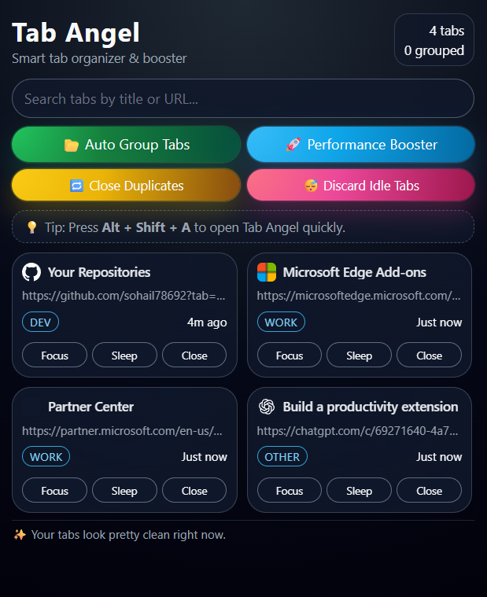

# Tab Angel – Smart Tab Organizer

> **A Chrome extension that automatically organizes your tabs, boosts performance, and provides a beautiful visual UI for searching and managing tabs.**

---

## ✨ Features

- **Auto‑group tabs** by category (Media, Social, Shopping, Work, Dev, AI, Browser, Other) with colored groups.
- **Performance Booster** – close duplicate tabs and discard idle tabs in one click.
- **Search** – live fuzzy search across all open tabs (title & URL).
- **Idle / Heavy detection** – visual badges for tabs that have been idle for a long time or are heavy.
- **Quick actions** – focus, sleep (discard), or close a tab directly from the popup.
- **Keyboard shortcut** – `Alt + Shift + A` opens the Tab Angel popup from anywhere.
- **Premium UI** – dark glass‑morphism style, responsive grid, micro‑animations.

---

## 📦 Installation (for developers / testing)

1. **Clone the repository** (or download the source) to your local machine.
2. Open **Chrome** → **Extensions** (`chrome://extensions/`).
3. Enable **Developer mode** (toggle in the top‑right corner).
4. Click **Load unpacked** and select the folder `Tab Angel-extension`.
5. The extension icon will appear next to the address bar. Click it to open the popup.

---

## 🖥️ Usage

- Click the extension icon or press **Alt + Shift + A** to open the popup.
- Use the **search bar** to filter tabs instantly.
- Press **📂 Auto Group Tabs** to group tabs by category.
- Press **🚀 Performance Booster** to close duplicate tabs and discard idle ones.
- Individual tab cards provide **Focus**, **Sleep**, and **Close** buttons.

---

## 🛠️ Development

The project is built with plain HTML, CSS, and JavaScript (no framework). To modify the UI or logic:

1. Edit the files in `Tab Angel-extension/`:
   - `popup.html` – markup for the popup.
   - `popup.css` – styling (dark glass‑morphism, grid layout, animations).
   - `popup.js` – tab fetching, rendering, and actions.
   - `service-worker.js` – background service worker (handles install event and the shortcut command).
2. Reload the extension on the **Extensions** page after changes.
3. Use Chrome's developer tools (Console, Network) to debug the popup.

---

## 🤝 Contributing

Contributions are welcome! Feel free to:

- Report bugs or suggest features via **Issues**.
- Submit pull requests with improvements (UI tweaks, new features, refactoring).
- Follow the existing code style (vanilla JS, ES6 modules, CSS variables).

---

## 📞 Support

If you enjoy this project, please ⭐ the repository — it helps grow the project!

---

## 📄 License

This project is licensed under the **MIT License** – see the `LICENSE` file for details.

---

## 🎨 Screenshots

---
## 👤 Author

Sohail Akhtar
Made with ❤️ to help you focus and achieve greatness.

*Happy tab managing!*
